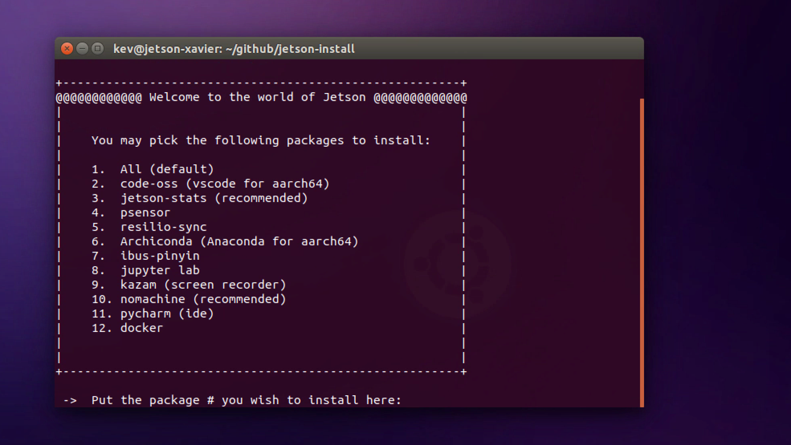

# Jetson-install

## Demo

## Intro

Jetson-install is a useful tool that allows you to download the most important softwares based on aarch64 architecture you may need for development on your jetson kit. It is compatible with TX1, TX2, Nano, Xavier, and even Rpi. There are 11 softwares listed. Please check out the intro below:

### oss-code

oss-code is the arm64 version of Visual Studio IDE.

### jetson-stats

jetson-stats is a package to monitoring and control your NVIDIA Jetson [Nano, Xavier, TX2i, TX2, TX1] embedded board.

### psensor

psensor is a graphical hardware temperature monitor for Linux. It can monitor: the temperature of the motherboard and CPU sensors (using lm-sensors). the temperature of the NVidia GPUs

### resilio-sync

Resilio Sync (formerly BitTorrent Sync) by Resilio, Inc. is a proprietary peer-to-peer file synchronization tool available for Windows, Mac, Linux, Android, iOS, Windows Phone, Amazon Kindle Fire and BSD. It can sync files between devices on a local network, or between remote devices over the Internet via a modified version of the BitTorrent protocol.

### Archiconda

Archiconda3 is a distribution of conda for 64 bit ARM. Anaconda is a free and open-source distribution of the Python and R programming languages for scientific computing (data science, machine learning applications, large-scale data processing, predictive analytics, etc.), that aims to simplify package management and deployment. Like Virtualenv, Anaconda also uses the concept of creating environments so as to isolate different libraries and versions.

### ibus-pinyin	

ibus-pinyin - Intelligent Chinese Phonetic IME for Hanyu pinyin and Zhuyin (Bopomofo) users. Designed by IBus main author and has many advance features such as English spell checking. ... ibus-rime - Powerful and smart input method for a wide range of Chinese input methods, based on the Rime IME project.

### jupyter lab	

JupyterLab is a next-generation web-based user interface for Project Jupyter. JupyterLab enables you to work with documents and activities such as Jupyter notebooks, text editors, terminals, and custom components in a flexible, integrated, and extensible manner.

### kazam

Kazam is a simple screen recording program that will capture the content of your screen and record a video file that can be played by any video player that supports VP8/WebM video format.

### nomachine (aarch64)

NoMachine is a free, cross-platform, serverless remot e desktop tool that lets you setup a remote desktop server on your computer using the NX video protocol. The client can be used to connect to the server from anywhere in the world.

### pycharm

PyCharm is an integrated development environment (IDE) used in computer programming, specifically for the Python language. It is developed by the Czech company JetBrains.

### docker

Docker is basically a container engine which uses the Linux Kernel features like namespaces and control groups to create containers on top of an operating system and automates application deployment on the container. Docker uses Copy-on-write union file system for its backend storage.

## How to use
